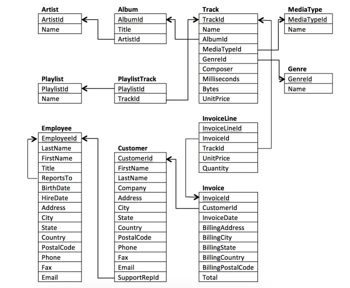

# Chinook Digital Music Store - Analysis Summary

This data analysis project aimed at assisting Chinook Digital Music Store in optimizing business opportunities and addressing key business-related questions.It contains information about the artists, songs, and albums from the music shop, as well as information on the shop's employees, customers, and the customers purchases.

## Business Questions

1. Create a query that create a list of customers who are not in the USA, include their customer ID, full name and country.
2. Create a query showing a unique list of billing countries from the Invoice table
3. Who are the top 5 artists to produce most albums?
4. Number of tracks sold per genre
5. Rock sales per year
6. What are the top 3 cities
7. Top 5 billing countries
8. Top 10 customers
9. Which city has the best customers?
10. Who is the best customer?
11. Which top 3 customers had the highest total of invoices?
12. Which countries have the most Invoices?

## Schema

**Chinook Schema**

## Tools

- Microsoft SQL Server
